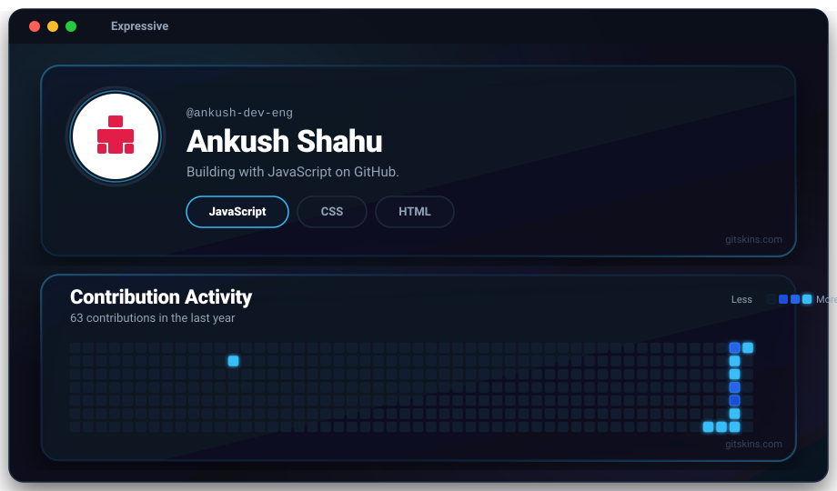

  

---

### Hi there, I'm Ankush Shahu 👋

Building with JavaScript on GitHub.

#### 🛠️ Tech Stack & Skills
- **Languages:** JavaScript (ES6+), HTML5, CSS3
- **Tools & Ecosystem:** Git, GitHub, Node.js

#### 📊 GitHub Stats & Contributions
- **Username:** `@ankush-dev-eng`
- **Profile Skin Theme:** Expressive Dark (via `gitskins.com`)

---

  Designed with ❤️ for <a href="https://github.com/ankush-dev-eng">ankush-dev-eng</a>

